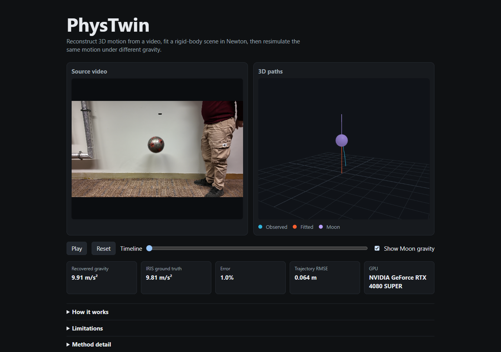

# PhysTwin

PhysTwin reconstructs 3D motion from a video, fits a small rigid-body scene
by running Newton on the GPU, then resimulates that scene under different
physics.

On IRIS `Falling_ball/big/01.mp4` it recovered **9.91 m/s²** versus the IRIS
value **9.81 m/s²** (1.0% error). Trajectory RMSE is **0.064 m** (normalized
0.107) on an RTX 4080 SUPER.



## Demo

The public page shows one IRIS clip: a soccer ball in mid-air, 1.40–1.90 s,
16 frames.

Scale comes from the measured ball radius, 0.11 m. SAM2 tracks the mask.
Depth comes from the silhouette and the camera matrix, not from DA3 depth.
Newton then fits gravity and the initial vertical speed.

This run:

- Recovered gravity: 9.912 m/s²
- IRIS gravity (unread during the fit): 9.81 m/s²
- Gravity error: 1.0%
- RMSE: 0.064 m
- Normalized RMSE: 0.107
- GPU: NVIDIA GeForce RTX 4080 SUPER, 88 Newton evaluations, 18.6 s

The purple Moon path is the same fitted drop with gravity set to 1.62 m/s².
It was not observed.

Details: [docs/evaluation/iris-falling-ball.md](docs/evaluation/iris-falling-ball.md)

## How it works

```text
Video
  → SAM2 tracking
  → DA3 camera
  → known-radius sphere reconstruction
  → PhysicalMotionObservation
  → Newton + Warp inverse fit
  → PhysicalScene
  → counterfactual rollout
```

## Architecture

The current design is [docs/architecture-3d.md](docs/architecture-3d.md).

The important ownership split:

- `SceneObservation` is reconstructed visual evidence. DA3 scale is relative.
- `PhysicalMotionObservation` is metric body-origin samples used by the fit.
- `PhysicalScene` is one physical explanation to execute.
- `SimulatedWorldState` is the Newton rollout the browser plays back.

The older image-space product is [docs/architecture.md](docs/architecture.md).

## Evaluation

**Real clip.** IRIS falling ball recovered 9.91 vs 9.81 m/s², RMSE 0.064 m.
See the demo note above.

**Synthetic.** A Newton-generated tether recovers rest length and two tangent
speeds to 1.58 mm RMSE. A synthetic free-fall recovers gravity near 9.81 m/s²
without using that value as the search start.

**Earlier experiment.** IRIS `pendulum_45/01` completed a Newton run and
failed as physics. RMSE was 0.616 m on a 0.320 m extent. Small-object DA3
depth flattened the swing, the calibration pair was the clamp centroid rather
than the string exit, and a 0.50 m XPBD rod is not rigid in this runtime.
That residual is kept. See
[docs/evaluation/iris-pendulum-45-01-diagnosis.md](docs/evaluation/iris-pendulum-45-01-diagnosis.md).

V1 also has recorded 2D Mixkit and pendulum numbers in
[docs/evaluation.json](docs/evaluation.json). Those are image-space fits, not
metric 3D gravity recovery.

## Limitations

- Monocular reconstruction needs a measured length or radius.
- Physics is one rigid sphere plus gravity. No contact, drag, or articulated
  humans.
- Counterfactuals are simulated hypotheses, not observations.
- DA3 camera translation is in reconstruction units, not meters.
- One falling-ball clip is not a dataset-wide claim.

## Running locally

Windows. Visual Studio 18 Community, Node.js, CUDA GPU.

```powershell
powershell -ExecutionPolicy Bypass -File .\scripts\build.ps1
powershell -ExecutionPolicy Bypass -File .\scripts\setup-vision.ps1
powershell -ExecutionPolicy Bypass -File .\scripts\setup-physics.ps1
```

Local UI (binds 127.0.0.1). If port 8765 is taken, set `PHYSTWIN_PORT`:

```powershell
cd frontend
npm install
npm run build
cd ..
$env:PHYSTWIN_PORT = "8766"
.\.venv\Scripts\python.exe vision\serve.py
```

IRIS media stays out of git. Download `rasulkhanbayov/IRIS` under
`datasets/IRIS/` to see the source video. The 3D paths still load from the
committed demo payload.

Falling-ball prepare and fit (needs the IRIS clip and both venvs):

```powershell
.\.venv\Scripts\python.exe vision\prepare_falling_ball.py
.\.venv-physics\Scripts\python.exe -m physics3d.fit_physical_scene `
  results\physics3d\p5r-falling-ball\aligned_physical_scene_template.json `
  --motion-observation results\physics3d\p5r-falling-ball\target_motion_observation.json `
  --profile free_fall_gravity_v1 `
  --output results\physics3d\p5r-falling-ball
```

CTest:

```powershell
powershell -ExecutionPolicy Bypass -File .\scripts\test.ps1
```

## Stack

C++20, Python, SAM2, Depth Anything 3, NVIDIA Newton 1.5.1, Warp 1.16, CUDA,
React, TypeScript, Three.js.

## Possible extensions

Articulated humans, contact, automatic model selection, and richer
counterfactuals are all open. They are not part of this tree.
