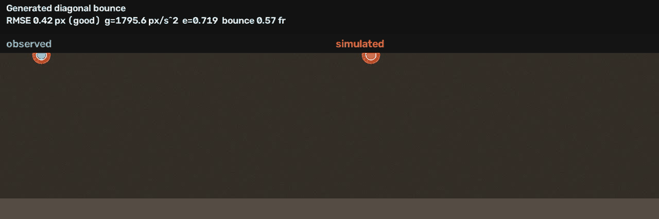

# PhysTwin

PhysTwin turns a short real-world video into a small, quantitatively fitted physics reconstruction: select one moving object, track it on the GPU, infer the physical parameters that best reproduce its motion, and compare the recorded and simulated trajectories side by side.

**Status:** Checkpoint 4. The video → SAM 2 → C++ fit loop is measured on three clips. Observed-vs-simulated overlays and RMSE live below. There is no React or Three.js UI.



The GIF is the generated diagonal clip: left is SAM 2 centroids on the video, right is the C++ reconstruction. RMSE on this case is **0.42 px** (`good`).


Recorded Mixkit still: [docs/demo/mixkit_overlay.png](docs/demo/mixkit_overlay.png). Near-vertical drop GIF: [docs/demo/drop_overlay.gif](docs/demo/drop_overlay.gif). Raw numbers: [docs/evaluation.json](docs/evaluation.json).

## What it does

```text
video + one click
  → vision/track.py     SAM 2 on the RTX 4080 SUPER
  → tracking.json
  → phystwin fit        C++20, image-space vx0, vy0, g, e
  → reconstruction.json
  → overlay + RMSE
```

Python owns tracking. C++ owns physics, fitting, and metrics. The languages talk through JSON files.

## Results

Measured on 2026-08-25. Copied from `docs/evaluation.json`. Not invented.

| Case | Kind | RMSE | Quality | Bounce timing | Track time |
|---|---|---|---|---|---|
| Mixkit tennis | recorded 281 frames, 24 fps | 13.79 px | fair | 1.00 frame (41.67 ms) | 19.96 s, 14.1 FPS |
| Generated diagonal | SAM 2 on rendered clip | 0.42 px | good | 0.57 frame (9.52 ms) | 12.05 s, 14.9 FPS |
| Generated drop | SAM 2 on rendered clip, `e=0.40` | 0.35 px | good | 1.56 frame (25.93 ms) | 11.71 s, 15.4 FPS |
| C++ synthetic | noise-free 241 frames, not video | 9.01e-07 px | good | n/a | fit 0.017 s |

Mixkit clip: [Tennis Ball Bouncing in Slow Motion](https://mixkit.co/free-stock-video/tennis-ball-bouncing-in-slow-motion-101289/). Click `--point 375,722`. Fitted `vx0=-9.51 px/s`, `vy0=706.54 px/s`, `g=173.15 px/s^2`, `e=0.665`. Vertical bounce shape is close. Horizontal velocity is not constant in this close-up, so the grade is `fair`, not `good`.

Generated diagonal draw parameters vs SAM 2 + C++ fit:

```text
                draw     fitted
vx0 px/s        140      140.00
vy0 px/s         20       20.77
g px/s^2       1800     1795.65
e               0.72      0.719
```

Generated drop:

```text
                draw     fitted
vx0 px/s          4        4.08
vy0 px/s         50       49.74
g px/s^2       1600     1600.06
e               0.40      0.400
```

The generated files are rendered footage, then tracked with SAM 2 like a real video. They are not a substitute for a phone clip, but they do exercise the full JSON boundary. The C++ synthetic row is a noise-free fitter check. It is not tracking evidence.

All gravity values are image-space scales, not `9.81 m/s^2`.

## How it works

See [docs/architecture.md](docs/architecture.md) for coordinates, units, the physics model, and the JSON boundary.

Short version: Python writes pixel-space observations. C++ fits `vx0`, `vy0`, gravity scale `g`, and restitution `e` in image coordinates. Overlay compares those trajectories on the source frames.

## Architecture

```text
video + click
    → vision/track.py              Python / PyTorch / SAM 2 / RTX 4080
    → tracking.json
    → phystwin fit                 C++20
    → reconstruction.json
    → plot_reconstruction.py
    → overlay_comparison.py        side-by-side video + GIF
```

No gRPC, queues, or a web frontend in V1.

## System identification

`vx0` uses scalar linear least squares. A fixed-seed bounded search followed by coordinate refinement minimizes squared vertical residuals for `vy0`, `g`, and `e`. This derivative-free choice handles the hard collision clamp without adding Ceres.

Fit quality is per-axis RMSE divided by travel on that axis. `good` is at most 5%, `fair` is at most 15%, otherwise `poor`. `fair` still writes the reconstruction and exits 0. `poor` exits 2.

## GPU video tracking

`vision/track.py` loads official SAM 2.1 tiny on CUDA, takes one click on frame 0, propagates the mask, and writes mask-derived centroids.

Device on these runs: **NVIDIA GeForce RTX 4080 SUPER**, torch `2.13.0+cu126`. Model: SAM 2.1 Hiera tiny. Empty-mask count was 0 on all three clips.

`--point` is numeric `x,y`. Clicking a PNG in the editor only zooms the image.

## Evaluation

Four recorded cases live in [docs/evaluation.json](docs/evaluation.json). Re-run them with:

```powershell
powershell -ExecutionPolicy Bypass -File .\scripts\run-eval.ps1
```

That script generates the two rendered clips, tracks any missing cases, fits, writes overlays under `docs/demo/`, and refreshes `docs/evaluation.json`. Mixkit tracking is reused if `results\cases\mixkit_tennis\tracking.json` already exists.

Bounce timing is a high-y local-max heuristic paired within 8 frames. It is an evaluation check, not part of the optimizer. On the damped drop, the detector also marks extra late simulated contacts. Trust RMSE first.

## Build and run

Windows, Visual Studio 18 Community. CMake is bundled with Visual Studio. It is **not** on PATH in a regular PowerShell.

```powershell
powershell -ExecutionPolicy Bypass -File .\scripts\build.ps1
powershell -ExecutionPolicy Bypass -File .\scripts\setup-vision.ps1
.\.venv\Scripts\python.exe vision\check_cuda.py
```

One Mixkit reconstruction (needs `samples\bounce.mp4` locally):

```powershell
.\.venv\Scripts\python.exe vision\track.py samples\bounce.mp4 --dump-frame results\frame0.png
.\.venv\Scripts\python.exe vision\track.py samples\bounce.mp4 --point 375,722 --output results\tracking.json
.\build\Release\phystwin.exe fit results\tracking.json --output results\reconstruction.json
.\.venv\Scripts\python.exe vision\plot_reconstruction.py results\tracking.json results\reconstruction.json
.\.venv\Scripts\python.exe vision\overlay_comparison.py samples\bounce.mp4 results\tracking.json results\reconstruction.json --still results\overlay_still.png
```

Generated diagonal clip through the same loop:

```powershell
.\.venv\Scripts\python.exe vision\make_bounce_clip.py --output samples\generated_diagonal.mp4 --x0 80 --y0 40 --vx 140 --vy 20 --g 1800 --e 0.72
.\.venv\Scripts\python.exe vision\track.py samples\generated_diagonal.mp4 --point 80,40 --output results\cases\generated_diagonal\tracking.json
.\build\Release\phystwin.exe fit results\cases\generated_diagonal\tracking.json --output results\cases\generated_diagonal\reconstruction.json
.\.venv\Scripts\python.exe vision\overlay_comparison.py samples\generated_diagonal.mp4 results\cases\generated_diagonal\tracking.json results\cases\generated_diagonal\reconstruction.json --gif docs\demo\diagonal_overlay.gif --still docs\demo\diagonal_overlay.png --title "Generated diagonal bounce"
```

Generated drop uses `--x0 320 --y0 36 --vx 4 --vy 50 --g 1600 --e 0.40` and `--point 320,36`.

CMake without the helper, if VS CMake is already on PATH:

```powershell
. .\scripts\vs-cmake.ps1
Use-VsCMake
cmake -S . -B build -G "Visual Studio 18 2026" -A x64
cmake --build build --config Release
ctest --test-dir build -C Release --output-on-failure
```

## Limitations

- Mixkit is slow-motion close-up stock footage. Constant `vx` fails enough to grade `fair` (13.79 px RMSE, 9.30% worst-axis error).
- Two of the three video cases are rendered balls, then tracked. A fixed-camera phone clip is still a stronger recorded-physics test.
- Monocular video has no metric scale. Fitted `g` is px/s^2.
- One object, fixed camera, one ground line. No spin, drag, friction, or wall collisions in V1.
- Bounce-contact frames are a plot heuristic. Late low-amplitude bounces can add extra detections. Pixel RMSE is the number to quote.
- SAM 2's optional CUDA hole-filling kernel is not built (`nvcc` is missing). Tracking still runs on GPU through PyTorch.
- System Python on this machine is 3.14 beta. Use `scripts\setup-vision.ps1` so SAM 2 / PyTorch run on 3.11.
- No React / Three.js viewer. The overlay GIF and the three-case plot are the demo.

## Roadmap

After V1: known-length scale calibration, extra collision planes, rotation, friction, a phone-camera clip, optional UI. Not required for this checkpoint.
