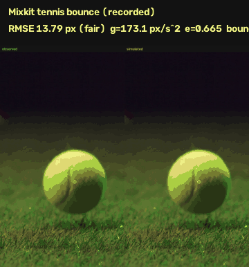
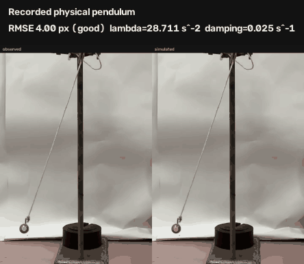

# PhysTwin

**Video → reconstructed world → executable physics twin**

PhysTwin currently ships a working 2D proof-of-concept. It tracks one object
in a short video, fits a selected dynamics model in C++20, and replays the
reconstructed motion beside the recording in Three.js.

Implemented model families:

- **Projectile / Bounce:** initial velocity, image-space gravity, ground collision, and restitution.
- **Swing / Pendulum:** full nonlinear damped motion, fixed or tracked anchor, image-space radius, initial angular velocity, effective `g/L`, and damping.

The Three.js scene uses positions from C++ reconstruction output. It does not run a second physics model in the browser.

## 3D direction

New development moves the canonical state from pixels to a reconstructed 3D
scene, recovered camera, world-space motion, and an executable physical scene.
Image observations remain evidence for reprojection and validation.

P1 adds one reconstruction path on `feat/3d-video-to-sim-pivot`: a short real
clip goes through pinned Apache-2.0 DA3-BASE, writes a cached
`SceneObservation`, and shows the recovered camera plus a point cloud beside
the recording. Scale stays relative. V1 fitting is unchanged.

P2 maps TRAM body and camera output into the same first-camera graphics world.
TRAM was chosen over GVHMR because the TRAM code is MIT. GVHMR is
non-commercial research-only. Live TRAM still needs a separate install and
SMPL weights. This repo converts official TRAM files or a committed fixture.
In the UI, **Inspect P2 human fixture** shows a 3D stick figure synced to a
projected skeleton video.

The complete design is in [docs/architecture-3d.md](docs/architecture-3d.md).

The preserved V1 baseline is
`b14b9a95f676e571e4b096f643663ef76cf34e03` on `main`. Projectile, pendulum,
SAM 2 tracking, evaluations, and the current UI remain supported on the pivot
branch.

P1 reconstruction (needs the vision venv plus `scripts/setup-reconstruction.ps1`):

```powershell
.\.venv\Scripts\python.exe vision\reconstruct.py samples\bounce.mp4 --max-frames 12 --duration-s 2
```

That writes a cached `SceneObservation` under `results/cache/reconstruction/`. In the UI, switch to **3D scene + camera**. The default **2D physics twin** path is unchanged.

P2 human conversion (no live TRAM required for the fixture):

```powershell
.\.venv\Scripts\python.exe vision\reconstruct_humans.py --from-fixture
.\.venv\Scripts\python.exe vision\reconstruct_humans.py --walk-fixture --write-video results\human_fixture.mp4
```

Official TRAM import, after you run TRAM yourself, is
`vision\reconstruct_humans.py --tram-dir <tram>\results\<seq>`. See
`scripts/setup-humans.ps1`.

P3 reconstruction evaluation is complete. The synthetic fixture checks
camera/body alignment and metric behavior:

```powershell
.\.venv\Scripts\python.exe vision\evaluate_reconstruction.py --fixture
```

That fixture is not EMDB evidence. An EMDB measured run is optional and
unavailable here. The adapter stays in the repo. EMDB is not a physics
blocker. See
[docs/reconstruction-evaluation-p3.md](docs/reconstruction-evaluation-p3.md).

P4 adds the first executable 3D `PhysicalScene`. It runs one sphere under
gravity with a native Newton fixed-distance joint, writes a project-owned
`SimulatedWorldState`, and displays that saved rollout in Three.js.

```powershell
powershell -ExecutionPolicy Bypass -File .\scripts\setup-physics.ps1
.\.venv-physics\Scripts\python.exe -m physics3d.simulate_physical_scene `
  contracts\3d\v1\examples\physical_scene_tether.json `
  --output results\physics3d\p4-tether `
  --repeat-check
```

The physics environment pins Apache-2.0 Newton `1.5.1` and Warp `1.16.0`
separately from the vision environment. In the UI, switch to **3D physics**
and select **Inspect P4 physics fixture**. See
[docs/physics-runtime-p4.md](docs/physics-runtime-p4.md) for the contract,
coordinate conversion, versions, and measured invariants.

P5 fits the P4 tether rest length and two initial tangent-velocity components
to metric 3D body-origin samples:

```powershell
.\.venv-physics\Scripts\python.exe -m physics3d.fit_physical_scene `
  contracts\3d\v1\examples\physical_scene_tether_fit_template.json `
  --fixture `
  --output results\physics3d\p5-tether-fit
```

The synthetic fixture has known values and writes a
`PhysicalMotionObservation`, fitted `PhysicalScene`, final
`SimulatedWorldState`, and `InversePhysicsFit`. In the UI, select
**Inspect P5 synthetic fit** to compare blue target samples with the orange
Newton rollout.

Real P1/P2 human fitting still requires measured metric scale plus an
observable 3D pelvis track. Current DA3/TRAM outputs do not meet that gate, so
the result is `BLOCKED_INPUT`. No real human-fit values are reported. See
[docs/physics-fitting-p5.md](docs/physics-fitting-p5.md).

P5R adds a generic `entities.v1` object track, SAM2+DA3 world-XYZ lift, and
known-distance metric calibration so real inverse physics does not depend on
`humans.v1`. The first completed real fit used IRIS
`Pendulum/pendulum_45/01.mp4`. Evidence kind is `external_dataset`. IRIS
`rope_length` `0.50 m` set metric scale and held `rest_length_m` fixed. This
is not independent rope-length recovery. Local recorded clips still have no
tape-measured length. The pipeline will not invent scale.

The saved IRIS run is `execution_valid` and `quality` `unassessed`. Final RMSE
is `0.616 m` on a `0.320 m` observed extent. That residual is poor. See
[docs/evaluation/iris-p5r-pendulum-45-01.md](docs/evaluation/iris-p5r-pendulum-45-01.md).

```powershell
.\.venv\Scripts\python.exe vision\prepare_real_motion.py --inspect
```

In the UI, select **Inspect P5R real fit**. See
[docs/physics-fitting-p5r.md](docs/physics-fitting-p5r.md).



This is the recorded projectile case. Mixkit [Tennis Ball Bouncing in Slow Motion](https://mixkit.co/free-stock-video/tennis-ball-bouncing-in-slow-motion-101289/), 281 frames at 24 fps.

```text
RMSE            13.79 px   fair
RMSE_x           8.40 px   9.30% of 90.3 px horizontal travel
RMSE_y          10.94 px   1.57% of 695.6 px vertical travel
bounce timing    1.00 frame (41.67 ms)
g              173.15 px/s^2
e                0.665
track           19.96 s end-to-end (14.1 FPS including model load and decode)
fit              0.019 s
```

The horizontal signal is weak because its 90 px travel is smaller than the tracked mask radius. The vertical bounce is the useful signal and fits to 1.57% of its travel.

## Evidence

Evidence classes are kept separate:

- **Recorded:** real camera footage.
- **Rendered:** generated or CGI video passed through the full SAM 2 and C++ pipeline.
- **Cinematic stress:** copyrighted movie footage used only to measure model mismatch.
- **Synthetic:** direct known-parameter C++ validation without video.

Current measured results are saved in [docs/evaluation.json](docs/evaluation.json).

### Recorded projectile

- Mixkit tennis bounce: `13.79 px RMSE`, `fair`.
- Vertical RMSE: `10.94 px`, or `1.57%` of vertical travel.
- Bounce timing error: `1.00 frame`, or `41.67 ms`.
- Fitted `g`: `173.15 px/s²`.
- Fitted restitution: `0.665`.

### Pendulum synthetic validation

- Noise-free nonlinear recovery: `1.29e-10 px RMSE`.
- Recovered `omega0`, `lambda`, and damping agree with their known values to about `1e-12`.
- Deterministic noise and three outliers: `2.63 px RMSE`.
- Noisy `lambda`: `7.19915` for known `7.2`.
- Noisy damping: `0.217734` for known `0.22`.
- Shared camera translation with a tracked anchor: `2.49e-11 px RMSE`, with `lambda=7.2` recovered exactly at the printed precision.
- Eight failure checks cover too few observations, stationary motion, near-zero radius, inconsistent pivot geometry, invalid timestamps, misaligned anchors, low anchor coverage, and changing relative radius.
- A fast-motion regression case recovers `lambda=32.0` at `5.84e-12 px RMSE` and protects the period-derived search bound.

### Recorded physical pendulum



The fixed-camera physical pendulum is 663 frames at 30 fps after trimming the first 70 source frames to remove hand contact:

- 663 of 663 frames tracked.
- `43.27 s` end-to-end tracking on an RTX 4080 SUPER.
- `4.00 px RMSE`, or `0.49%` of the fitted `824.75 px` radius, classified `good`.
- `3.36 px` horizontal RMSE and `2.18 px` vertical RMSE.
- Fitted `lambda=28.711 s⁻²`, damping `0.0246 s⁻¹`, and initial angular velocity `-0.314 rad/s`.
- Target-to-pivot radial MAD: `1.17 px`.

### Cinematic swing stress case

The user-provided *The Amazing Spider-Man* segment from `203.00 s` to `206.00 s` (`3:23` to `3:26`) is 90 frames at 29.97 fps. It is not a real-world correctness claim.

- SAM 2 kept both Spider-Man and the lower red crane beacon in 68 of 90 frames. The last ~22 frames (dive / blur) lost both masks.
- All 68 valid-target frames had a paired anchor. C++ reports 100% coverage among those frames. Clip-level coverage is 68/90.
- Frame 0 clicks: target `820,420`, anchor `1115,663`.
- Tracked-anchor result: `33.54 px RMSE`, `fair`.
- Fixed-pivot baseline on the same 68 frames: `123.02 px RMSE`, `poor`.

On this interval, subtracting shared image-space anchor translation beats a frozen click. That is still not a physical measurement. First-frame SAM masks bloated onto sky and buildings, the camera still rotates, perspective changes, and Spider-Man moves his body. The fitted cinematic parameters are not physical measurements.

## Local UI

One command after the venv and `phystwin.exe` exist:

```powershell
powershell -ExecutionPolicy Bypass -File .\scripts\serve-ui.ps1
```

Open http://127.0.0.1:8765.

For projectile motion:

1. Choose **Projectile / Bounce**.
2. Pick a sample or upload a video.
3. Click the tracked object.
4. Run, then play or scrub the synchronized recording and twin.

For pendulum motion:

1. Choose **Swing / Pendulum**.
2. Pick a sample or upload a clip.
3. Click the bob.
4. Keep **Fixed pivot**, or choose **Track anchor through clip** when the physical attachment point stays visible and moves in frame.
5. Click the pivot or anchor.
6. Run, then inspect the moving reference, rod, reconstructed bob, trajectories, parameters, coverage, and fit warning.

`scripts\serve-ui.ps1 -Dev` runs Vite at http://127.0.0.1:5173 and proxies `/api` to the same FastAPI process.

The browser never talks to C++ or PyTorch directly. `vision/serve.py` binds 127.0.0.1 only.

## How it works

See [docs/architecture.md](docs/architecture.md) for the current V1
coordinates, units, physics models, and JSON boundary. See
[docs/architecture-3d.md](docs/architecture-3d.md) for the additive 3D
migration boundary.

The ownership split is explicit:

- **C++20:** simulation, system identification, robust objectives, geometry checks, reconstruction samples, and metrics.
- **Python, PyTorch, and SAM 2:** GPU video tracking and pixel-space observations.
- **React, TypeScript, and Three.js:** interaction, synchronized playback, and visualization.
- **FastAPI:** localhost-only orchestration between the browser, tracker, and executable.

## Architecture

```text
video + model choice + selections
    → vision/serve.py              FastAPI on 127.0.0.1:8765
    → vision/track.py              Python / PyTorch / SAM 2 / RTX 4080
    → model-aware tracking.json
    → phystwin fit                 C++20 model dispatch
    → model-aware reconstruction.json
    → frontend/                    React + TypeScript + Three.js
```

CLI overlay plots still work. They are not required for the product loop.

No gRPC, queues, or cloud services.

## System identification

Projectile fitting uses scalar least squares for `vx0`. A fixed-seed bounded differential search followed by deterministic coordinate refinement fits `vy0`, image-space gravity `g`, and restitution `e`.

Pendulum fitting uses:

```text
theta'' = -lambda * sin(theta) - damping * theta'
```

The fitter uses actual observation timestamps. Fixed mode derives angle from the target and one pivot. Tracked mode derives it from `target(t) - anchor(t)` and reconstructs absolute positions by adding the measured anchor path back. Fixed mode allows bounded pivot refinement. Tracked mode does not. Both modes estimate radius with medians and fit initial angular velocity, effective `lambda = g/L`, and non-negative damping. The observed zero-crossing period seeds and bounds the `lambda` search. A Huber objective limits the effect of a few bad observations.

Pendulum quality is RMSE divided by fitted image-space radius. `good` is at most 5%, `fair` is at most 15%, otherwise `poor`.

Both solvers are deterministic. `poor` still writes reconstruction JSON for diagnosis and exits with code 2. Ceres is not used.

## GPU video tracking

`vision/track.py` loads official SAM 2.1 tiny on CUDA. It propagates one target mask and, in tracked-anchor mode, one anchor mask in the same predictor pass. Anchor rows are paired with target rows by frame. The frame-0 click offset from the anchor mask centroid is preserved. Missing anchor masks reduce reported coverage instead of creating points. If the video has no valid fps metadata, tracking fails instead of assuming 30 fps.

Device on these runs: **NVIDIA GeForce RTX 4080 SUPER**, torch `2.13.0+cu126`. Model: SAM 2.1 Hiera tiny. The recorded pendulum tracked 663 of 663 frames in `43.27 s` end-to-end.

`--point` is numeric `x,y`. Clicking a PNG in the editor only zooms the image.

Tracking FPS in the table is **end-to-end**: model load, JPEG decode, SAM 2 init, and propagation.

## Evaluation

Nine cases live in [docs/evaluation.json](docs/evaluation.json):

- recorded projectile;
- explicit projectile poor fit;
- two rendered projectile controls;
- projectile synthetic recovery;
- pendulum synthetic and noisy/outlier recovery;
- recorded physical pendulum;
- fixed and tracked-anchor cinematic stress results.

Re-run with:

```powershell
powershell -ExecutionPolicy Bypass -File .\scripts\run-eval.ps1
```

The script requires `samples\bounce.mp4`. It also evaluates the physical pendulum and local cinematic sample when those files exist:

```powershell
powershell -ExecutionPolicy Bypass -File .\scripts\run-eval.ps1 `
  -PendulumPoint "111,858" -PendulumPivot "385,92" `
  -CinematicPoint "820,420" -CinematicAnchor "1115,663"
```

Bounce timing is a high-y local-max heuristic paired within 8 frames. It is an evaluation check, not part of the optimizer.

## Build and run

Windows, Visual Studio 18 Community, Node.js (for the UI). CMake is bundled with Visual Studio. It is **not** on PATH in a regular PowerShell.

```powershell
powershell -ExecutionPolicy Bypass -File .\scripts\build.ps1
powershell -ExecutionPolicy Bypass -File .\scripts\setup-vision.ps1
.\.venv\Scripts\python.exe vision\check_cuda.py
```

`scripts\build.ps1` already runs CTest. To re-run tests later from a regular PowerShell (CMake is not on PATH):

```powershell
powershell -ExecutionPolicy Bypass -File .\scripts\test.ps1
```

Local product UI (needs Node.js, the venv, and `build\Release\phystwin.exe`):

```powershell
powershell -ExecutionPolicy Bypass -File .\scripts\serve-ui.ps1
```

One Mixkit reconstruction (needs `samples\bounce.mp4` locally):

```powershell
.\.venv\Scripts\python.exe vision\track.py samples\bounce.mp4 --dump-frame results\frame0.png
.\.venv\Scripts\python.exe vision\track.py samples\bounce.mp4 --point 375,722 --output results\cases\mixkit_tennis\tracking.json
.\build\Release\phystwin.exe fit results\cases\mixkit_tennis\tracking.json --output results\cases\mixkit_tennis\reconstruction.json
.\.venv\Scripts\python.exe vision\plot_reconstruction.py results\cases\mixkit_tennis\tracking.json results\cases\mixkit_tennis\reconstruction.json
.\.venv\Scripts\python.exe vision\overlay_comparison.py samples\bounce.mp4 results\cases\mixkit_tennis\tracking.json results\cases\mixkit_tennis\reconstruction.json --gif docs\demo\mixkit_overlay.gif --still docs\demo\mixkit_overlay.png --panel-height 320 --gif-stride 4 --gif-max-width 540 --gif-colors 48 --title "Mixkit tennis bounce (recorded)"
```

Generated diagonal clip through the same loop (pipeline check, not real-footage accuracy):

```powershell
.\.venv\Scripts\python.exe vision\make_bounce_clip.py --output samples\generated_diagonal.mp4 --x0 80 --y0 40 --vx 140 --vy 20 --g 1800 --e 0.72
.\.venv\Scripts\python.exe vision\track.py samples\generated_diagonal.mp4 --point 80,40 --output results\cases\generated_diagonal\tracking.json
.\build\Release\phystwin.exe fit results\cases\generated_diagonal\tracking.json --output results\cases\generated_diagonal\reconstruction.json
.\.venv\Scripts\python.exe vision\overlay_comparison.py samples\generated_diagonal.mp4 results\cases\generated_diagonal\tracking.json results\cases\generated_diagonal\reconstruction.json --gif docs\demo\diagonal_overlay.gif --still docs\demo\diagonal_overlay.png --title "Generated diagonal bounce"
```

Generated drop uses `--x0 320 --y0 36 --vx 4 --vy 50 --g 1600 --e 0.40` and `--point 320,36`.

Pendulum CLI path:

```powershell
.\.venv\Scripts\python.exe vision\track.py samples\recorded\pendulum.mp4 `
  --model pendulum --point 111,858 --pivot 385,92 `
  --output results\cases\pendulum_recorded\tracking.json

.\build\Release\phystwin.exe fit `
  results\cases\pendulum_recorded\tracking.json `
  --output results\cases\pendulum_recorded\reconstruction.json
```

The current recorded clip exits 0 with quality `good` and `4.00 px RMSE`.

Tracked-anchor CLI path:

```powershell
.\.venv\Scripts\python.exe vision\track.py samples\cinematic\spiderman_swing.mp4 `
  --model pendulum --anchor-mode tracked `
  --point 820,420 --pivot 1115,663 `
  --output results\cases\pendulum_cinematic\tracking_tracked.json
```

CMake without the helper, after putting VS CMake on the current session PATH:

```powershell
. .\scripts\vs-cmake.ps1
Use-VsCMake
cmake -S . -B build -G "Visual Studio 18 2026" -A x64
cmake --build build --config Release
ctest --test-dir build -C Release --output-on-failure
```

## Limitations

- All motion and fitted scales are image-space. There is no metric calibration, physical length, or metric gravity recovery.
- Pendulum assumes one bob, planar image-space motion, a nearly constant apparent radius, and one uninterrupted interval.
- Tracked-anchor mode compensates shared anchor translation only. It does not compensate camera rotation, zoom, perspective, changing cable length, or active body motion.
- Projectile assumes one point mass and one horizontal ground line. It does not model spin, drag, friction, or wall collisions.
- SAM 2's optional CUDA hole-filling extension is unavailable. PyTorch inference still runs on the GPU.
- The UI binds localhost only and runs one GPU job at a time.
