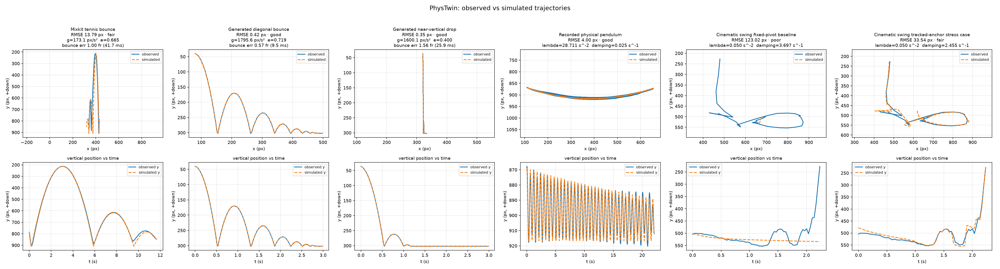

# PhysTwin

PhysTwin turns a short fixed-camera video into a fitted physics reconstruction: select one moving object, track it on the GPU, infer the physical parameters that best reproduce its motion, and compare the recording with the reconstructed trajectory and measured error.

**Status:** Checkpoint 7. Local React + TypeScript + Three.js UI on top of the audited C++/SAM 2 core. No Ceres. No extra recorded clips.


This is the **recorded** evidence. Mixkit [Tennis Ball Bouncing in Slow Motion](https://mixkit.co/free-stock-video/tennis-ball-bouncing-in-slow-motion-101289/), 281 frames at 24 fps, click `--point 375,722`. Left is SAM 2 centroids on the video. Right is the C++ reconstruction.

```text
RMSE            13.79 px   fair
RMSE_x           8.40 px   9.30% of 90.3 px horizontal travel
RMSE_y          10.94 px   1.57% of 695.6 px vertical travel
bounce timing    1.00 frame (41.67 ms)
g              173.15 px/s^2
e                0.665
track           19.96 s end-to-end (14.1 FPS including model load and decode)
fit              0.019 s
```

The `fair` grade is driven by the weak horizontal axis. Horizontal centroid travel (90 px) is smaller than the ball's mask radius (~184 px), so that axis is likely mask/centroid drift and perspective, not a measured lateral throw. The vertical bounce, which carries gravity and restitution, fits to 1.57% of its travel.



The left column is the Mixkit recording. The middle and right columns are **rendered** clips that use the same integrator family as the fitter, then go through SAM 2. Their 0.42 px and 0.35 px RMSE values are pipeline checks, not real-footage accuracy. Animated pipeline overlays: [diagonal](docs/demo/diagonal_overlay.gif), [drop](docs/demo/drop_overlay.gif). Raw numbers: [docs/evaluation.json](docs/evaluation.json).

## What it does

```text
video + one click
  → vision/track.py     SAM 2 on the RTX 4080 SUPER
  → tracking.json
  → phystwin fit        C++20, image-space vx0, vy0, g, e
  → reconstruction.json
  → overlay + RMSE
```

Python owns tracking. C++ owns physics, fitting, and metrics. A small FastAPI process on localhost connects the browser to those two. The languages still talk through JSON files.

## Results

Measured 2026-08-25. Copied from `docs/evaluation.json`. Not invented.

**Recorded (external validity)**

| Case | RMSE | Quality | Notes |
|---|---|---|---|
| Mixkit tennis, 281 frames, 24 fps | 13.79 px | fair | bounce 1.00 frame. Vertical 10.94 px / 1.57% of axis travel |

Fitted Mixkit parameters: `vx0=-9.51 px/s`, `vy0=706.54 px/s`, `g=173.15 px/s^2`, `e=0.665`. Gravity is an image-space scale, not `9.81 m/s^2`.

Saved failure case: same Mixkit tracking with `--ground-y 800` writes quality `poor`, ground violation 108.99 px, RMSE 54.72 px, and CLI exit code 2.

**Rendered pipeline checks (same assumed integrator, then SAM 2)**

Do not quote these as real-footage accuracy.

| Case | Draw θ | Fitted θ | RMSE | Quality |
|---|---|---|---|---|
| Generated diagonal | vx=140, vy=20, g=1800, e=0.72 | 140.00, 20.77, 1795.65, 0.719 | 0.42 px | good |
| Generated drop | vx=4, vy=50, g=1600, e=0.40 | 4.08, 49.74, 1600.06, 0.400 | 0.35 px | good |

End-to-end tracking: diagonal 12.05 s (14.9 FPS), drop 11.71 s (15.4 FPS). Bounce heuristic: 0.57 frame and 1.56 frame. On the damped drop the detector also marks extra late simulated contacts. Trust RMSE first.

**C++ synthetic (no video)**

Noise-free 241-frame recovery: RMSE 9.01e-07 px. Parameter errors are at most 2.5e-06. Perturbed negative-control RMSE 65.75 px. Search uses a fixed 160-generation DE budget. Fit 0.018 s.

## Resume wording

Safe with the current evidence. Do not add Ceres until it ships. Do not quote rendered 0.42/0.35 px as real-footage accuracy.

> Built a C++20 video-to-simulation system that converts GPU-tracked object motion from recorded footage into a fitted image-space physics reconstruction, estimating initial velocity, gravity scale, and collision restitution through numerical system identification.

> Integrated local PyTorch/SAM 2 video tracking on an NVIDIA RTX 4080 SUPER and evaluated reconstructed motion on one recorded Mixkit clip (13.79 px RMSE, 1.00 frame bounce timing, `fair`, with 1.57% vertical-axis error) plus rendered SAM 2 pipeline checks and a noise-free C++ synthetic recovery test.

> Shipped a local React + TypeScript + Three.js product UI, with a small FastAPI process that runs SAM 2 and `phystwin.exe`, then shows synchronized recording vs reconstructed motion, trajectories, fitted parameters, and poor-fit warnings.

## Local UI

One command after the venv and `phystwin.exe` exist:

```powershell
powershell -ExecutionPolicy Bypass -File .\scripts\serve-ui.ps1
```

Open http://127.0.0.1:8765. Pick the Mixkit sample or upload a clip, click the object on frame 0, then wait for real pipeline stages (decode, load SAM 2, track, fit). Play and scrub the recording next to the Three.js reconstruction.

`scripts\serve-ui.ps1 -Dev` runs Vite at http://127.0.0.1:5173 and proxies `/api` to the same FastAPI process.

The browser never talks to C++ or PyTorch directly. `vision/serve.py` binds 127.0.0.1 only.

## How it works

See [docs/architecture.md](docs/architecture.md) for coordinates, units, the physics model, and the JSON boundary.

Short version: Python writes pixel-space observations. C++ fits `vx0`, `vy0`, gravity scale `g`, and restitution `e` in image coordinates. Overlay compares those trajectories on the source frames.

## Architecture

```text
video + click in the local UI
    → vision/serve.py              FastAPI on 127.0.0.1:8765
    → vision/track.py              Python / PyTorch / SAM 2 / RTX 4080
    → tracking.json
    → phystwin fit                 C++20
    → reconstruction.json
    → frontend/                    React + TypeScript + Three.js
```

CLI overlay plots still work. They are not required for the product loop.

No gRPC, queues, or cloud services.

## System identification

`vx0` uses scalar linear least squares. A fixed-seed bounded search (160 generations) followed by coordinate refinement minimizes squared vertical residuals for `vy0`, `g`, and `e`. Refinement is a step-halving safety net. On the measured cases it accepts no improvement after the search, so do not treat `refinement_iterations` as adaptive convergence.

The hard collision clamp makes the objective non-smooth. This derivative-free path is the current solver. Ceres is not in the project.

Fit quality is per-axis RMSE divided by travel on that axis. `good` is at most 5%, `fair` is at most 15%, otherwise `poor`. `fair` still writes the reconstruction and exits 0. `poor` exits 2.

Default `y_ground` is the maximum observed centroid y, so `ground_violation` is zero unless `--ground-y` is set explicitly. The Mixkit `--ground-y 800` case is the saved demonstration of that path.

## GPU video tracking

`vision/track.py` loads official SAM 2.1 tiny on CUDA, takes one click on frame 0, propagates the mask, and writes mask-derived centroids. If the video has no valid fps metadata, tracking fails instead of assuming 30 fps.

Device on these runs: **NVIDIA GeForce RTX 4080 SUPER**, torch `2.13.0+cu126`. Model: SAM 2.1 Hiera tiny. Empty-mask count was 0 on all three clips.

`--point` is numeric `x,y`. Clicking a PNG in the editor only zooms the image.

Tracking FPS in the table is **end-to-end**: model load, JPEG decode, SAM 2 init, and propagation.

## Evaluation

Five cases live in [docs/evaluation.json](docs/evaluation.json): one recorded clip, one recorded poor-fit, two rendered pipeline checks, and C++ synthetic recovery. Re-run with:

```powershell
powershell -ExecutionPolicy Bypass -File .\scripts\run-eval.ps1
```

That script requires `samples\bounce.mp4`, tracks Mixkit into `results\cases\mixkit_tennis\`, writes the `--ground-y 800` failure case, and refreshes `docs\evaluation.json`.

Bounce timing is a high-y local-max heuristic paired within 8 frames. It is an evaluation check, not part of the optimizer.

## Build and run

Windows, Visual Studio 18 Community, Node.js (for the UI). CMake is bundled with Visual Studio. It is **not** on PATH in a regular PowerShell.

```powershell
powershell -ExecutionPolicy Bypass -File .\scripts\build.ps1
powershell -ExecutionPolicy Bypass -File .\scripts\setup-vision.ps1
.\.venv\Scripts\python.exe vision\check_cuda.py
```

`scripts\build.ps1` already runs CTest. To re-run tests later from a regular PowerShell (CMake is not on PATH):

```powershell
powershell -ExecutionPolicy Bypass -File .\scripts\test.ps1
```

Local product UI (needs Node.js, the venv, and `build\Release\phystwin.exe`):

```powershell
powershell -ExecutionPolicy Bypass -File .\scripts\serve-ui.ps1
```

One Mixkit reconstruction (needs `samples\bounce.mp4` locally):

```powershell
.\.venv\Scripts\python.exe vision\track.py samples\bounce.mp4 --dump-frame results\frame0.png
.\.venv\Scripts\python.exe vision\track.py samples\bounce.mp4 --point 375,722 --output results\cases\mixkit_tennis\tracking.json
.\build\Release\phystwin.exe fit results\cases\mixkit_tennis\tracking.json --output results\cases\mixkit_tennis\reconstruction.json
.\.venv\Scripts\python.exe vision\plot_reconstruction.py results\cases\mixkit_tennis\tracking.json results\cases\mixkit_tennis\reconstruction.json
.\.venv\Scripts\python.exe vision\overlay_comparison.py samples\bounce.mp4 results\cases\mixkit_tennis\tracking.json results\cases\mixkit_tennis\reconstruction.json --gif docs\demo\mixkit_overlay.gif --still docs\demo\mixkit_overlay.png --panel-height 320 --gif-stride 4 --gif-max-width 540 --gif-colors 48 --title "Mixkit tennis bounce (recorded)"
```

Generated diagonal clip through the same loop (pipeline check, not real-footage accuracy):

```powershell
.\.venv\Scripts\python.exe vision\make_bounce_clip.py --output samples\generated_diagonal.mp4 --x0 80 --y0 40 --vx 140 --vy 20 --g 1800 --e 0.72
.\.venv\Scripts\python.exe vision\track.py samples\generated_diagonal.mp4 --point 80,40 --output results\cases\generated_diagonal\tracking.json
.\build\Release\phystwin.exe fit results\cases\generated_diagonal\tracking.json --output results\cases\generated_diagonal\reconstruction.json
.\.venv\Scripts\python.exe vision\overlay_comparison.py samples\generated_diagonal.mp4 results\cases\generated_diagonal\tracking.json results\cases\generated_diagonal\reconstruction.json --gif docs\demo\diagonal_overlay.gif --still docs\demo\diagonal_overlay.png --title "Generated diagonal bounce"
```

Generated drop uses `--x0 320 --y0 36 --vx 4 --vy 50 --g 1600 --e 0.40` and `--point 320,36`.

CMake without the helper, after putting VS CMake on the current session PATH:

```powershell
. .\scripts\vs-cmake.ps1
Use-VsCMake
cmake -S . -B build -G "Visual Studio 18 2026" -A x64
cmake --build build --config Release
ctest --test-dir build -C Release --output-on-failure
```

## Limitations

- One recorded clip. Two of the three video cases are rendered balls that match the fitter's integrator, then tracked.
- Mixkit is slow-motion close-up stock footage. The `fair` grade comes from the horizontal axis (9.30% of 90 px travel). Vertical error is 1.57%.
- Monocular video has no metric scale. Fitted `g` is px/s^2.
- One object, fixed camera, one ground line. No spin, drag, friction, or wall collisions.
- Default ground is max observed centroid y, so ground-violation only appears with an explicit `--ground-y`.
- Bounce-contact frames are a plot heuristic. Pixel RMSE is the number to quote.
- SAM 2's optional CUDA hole-filling kernel is not built (`nvcc` is missing). Tracking still runs on GPU through PyTorch.
- System Python on this machine is 3.14 beta. Use `scripts\setup-vision.ps1` so SAM 2 / PyTorch run on 3.11.
- The UI is local-only. One GPU job at a time. Progress is stage-based, not a fake percent complete.

## Roadmap

After this UI: more recorded clips, optional calibration, a justified solver comparison. Not this checkpoint.
